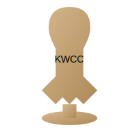

# Kings League KWCC Tournament Bracket

A dynamic, interactive tournament bracket for the Kings League World Cup Championship (KWCC). Users can click on teams to select winners, and the system will automatically progress them through the tournament.



## Features

- Interactive tournament bracket that allows users to select winners
- Teams progress through the tournament based on user selections
- Losers move to the appropriate brackets (losers bracket, last chance)
- State is saved in local storage so progress is maintained between sessions
- Fully responsive design that works on mobile and desktop
- Navigation buttons for mobile to quickly jump between tournament rounds
- Reset button to start over
- Animations for better user experience
- Fallback images for team logos
- SVG trophy with animations when a champion is crowned

## Project Structure

```
kings-league-kwcc/
├── css/
│   └── styles.css              # Styling for the tournament bracket
├── js/
│   ├── main.js                 # Main entry point
│   ├── data/                   # Data layer
│   │   ├── TeamsData.js        # Team information and utilities
│   │   ├── TournamentData.js   # Tournament structure
│   │   ├── Storage.js          # localStorage management
│   │   └── MatchResults.js     # Match results state
│   ├── core/                   # Business logic layer
│   │   ├── Tournament.js       # Tournament initialization
│   │   ├── BracketLogic.js     # Core tournament logic
│   │   ├── Match.js            # Match entity
│   │   └── Team.js             # Team entity
│   ├── ui/                     # UI components layer
│   │   ├── MatchRenderer.js    # Match/team rendering
│   │   ├── Champion.js         # Champion display
│   │   ├── Controls.js         # UI controls
│   │   └── Navigation.js       # Navigation components
│   └── utils/                  # Utilities layer
│       ├── TimeUtils.js        # Time/countdown utilities
│       ├── ImageUtils.js       # Image handling
│       ├── DragDrop.js         # Drag & drop functionality
│       └── Validators.js       # Validation utilities
├── img/
│   └── kwc-trophy.svg          # Vector trophy image
├── archive/
│   └── original-monolithic/    # Archived original files
├── deploy.js                   # Deployment script
├── package.json                # Project configuration
└── index.html                  # Main HTML file
```

## How to Run

### Option 1: Open locally

Simply open the `index.html` file in your web browser.

### Option 2: Using a local server

1. Install dependencies (requires Node.js):
   ```
   npm install
   ```

2. Start the local server:
   ```
   npm start
   ```

3. Your browser should automatically open to http://localhost:8080

## Deployment

To build and deploy the project:

1. Build the project:
   ```
   npm run build
   ```

2. The built files will be in the `dist` directory, ready for deployment.

3. To test the built version:
   ```
   npm run deploy
   ```

## How to Use

1. Click on a team in a match to select it as the winner
2. The selected team will be highlighted and will progress to the next round
3. The losing team will move to the appropriate losers bracket
4. Continue selecting winners until a champion is determined
5. Use the "Reset Tournament" button to start over
6. On mobile devices, use the navigation buttons at the top to jump between rounds

## Browser Compatibility

The tournament bracket has been tested and works in the following browsers:
- Chrome (latest)
- Firefox (latest)
- Safari (latest)
- Edge (latest)

## Technologies Used

- HTML5
- CSS3 (with animations)
- JavaScript (ES6+ modules)
- LocalStorage for state persistence
- SVG for trophy image
- Responsive design for mobile and desktop
- Modular architecture for maintainability

## Architecture

This project uses a modern modular architecture with ES6 modules:

- **Data Layer**: Manages team data, tournament structure, and state persistence
- **Core Layer**: Contains business logic for tournament progression and bracket management
- **UI Layer**: Handles all user interface components and rendering
- **Utils Layer**: Provides utilities for time handling, image management, and drag/drop
- **Main Entry**: Single entry point that orchestrates all modules

This architecture provides better maintainability, testability, and scalability compared to monolithic JavaScript files.

## Future Improvements

- Add real team logos when available
- Add sound effects for selections
- Implement sharing functionality
- Add statistics tracking
- Add print/export functionality
